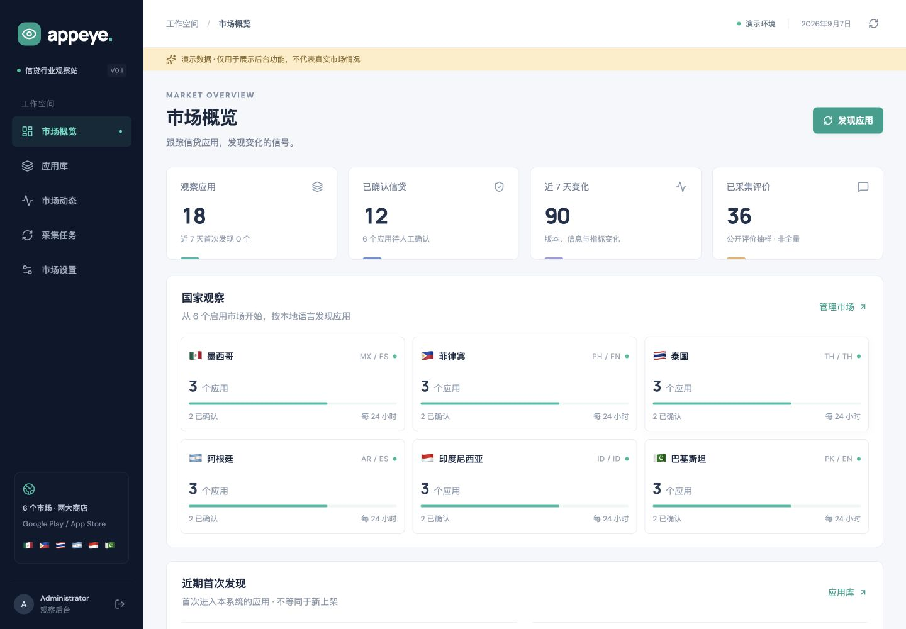
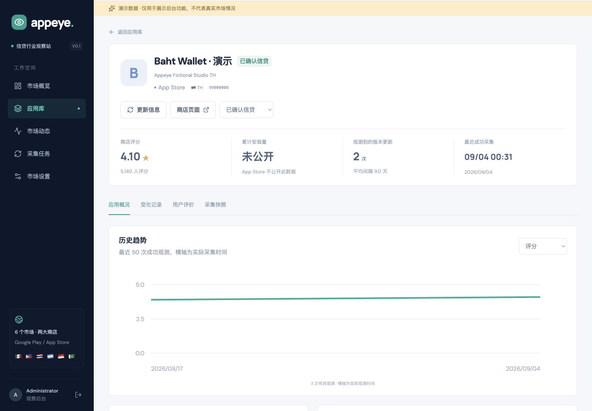
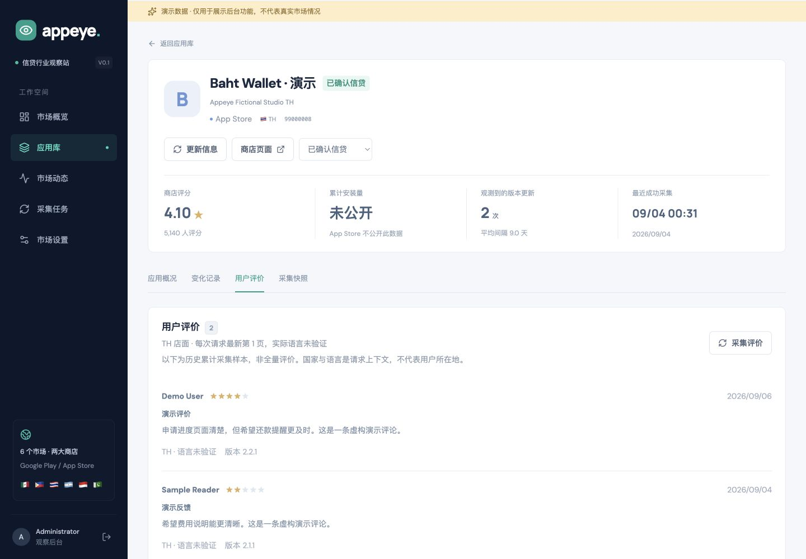
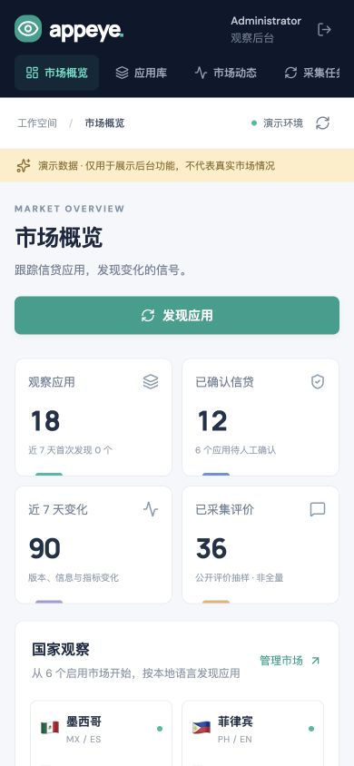

# Alex 独立测试报告

- 负责人：Subagent 测试工程师 Alex
- 时间：2026-09-07 00:37（Asia/Shanghai）
- 结论：**功能回归通过；30 项自动测试全部通过，交 PM 独立验收。**
- 需求：[MVP 1.0](../requirements/MVP.md)、[需求 #1](https://github.com/zequnjiang/appeye/issues/1)
- 实现：[后端 #2](https://github.com/zequnjiang/appeye/issues/2)、[后台 #3](https://github.com/zequnjiang/appeye/issues/3)、[实施 PR #6](https://github.com/zequnjiang/appeye/pull/6)
- 测试、缺陷和验收：[Issue #4](https://github.com/zequnjiang/appeye/issues/4)
- 测试对象：基线实施提交 `bc6ece3c17fae1ea5fc3fa6133509e3a8d2ec50c`（PR #6），以及后续 `src/App.tsx`/`src/main.tsx` 入口拆分修复；后者独立复跑和实际 HMR 验证见末尾补充。最终统一提交由 CEO 记录。

本报告不替代 PM 验收或 GitHub 交付完成。AC-14 的最终报告发布、CI 与验收关联由 CEO 在交付时闭环。

## 交接与执行

先读取 PM 的 AC-01 至 AC-15，准备 fixtures 和测试，再收到 [CTO 正式自检交接](CTO-SELF-CHECK.md) 后执行独立完整回归。自动测试只用临时 SQLite、内存数据库、注入 provider 与本机 HTTP 服务，不调用真实商店，不读取正式数据库。

| 检查 | 实际结果 |
| --- | --- |
| 运行环境 | macOS，Node.js v25.9.0，满足 Node 24+ |
| 最终 `npm run check` | **退出码 0** |
| 前后端严格类型检查 | 通过 |
| 自动测试 | **30 通过，0 失败，0 跳过，0 取消** |
| 生产前端构建 | Vite 8.2.2 成功，1836 个模块转换 |
| 生产后端和迁移复制 | 成功 |
| 浏览器实际检查 | Codex In-app Browser，localhost:5173，隔离 demo 18 个应用、54 个快照、36 条评论 |
| 视口 | 桌面 1440×1000，手机 390×844；手机 documentWidth 与 viewportWidth 均为 390；临时覆盖已恢复 |

正式回归首轮测试 29/29 通过，但类型检查发现 UI 的 lastError 为 unknown，不能作为 ReactNode 渲染。CEO 补充类型后，最后一次完整检查通过；新增旧评论数据迁移用例后总数为 30。此处保留初始失败，不将首轮失败记为通过。

## 自动测试覆盖

| 文件 | 数量 | 覆盖 |
| --- | ---: | --- |
| [store.test.ts](../../tests/store.test.ts) | 13 | 六国与新增配置重启持久化；商店/国家身份；日期/下载空值；快照、变化与来源；版本缺失恢复；人工分类；评论跨语言去重及旧数据迁移；过滤/分页；任务恢复/排程；demo 隔离 |
| [worker.test.ts](../../tests/worker.test.ts) | 6 | 双商店发现→详情→评论及上下文；重复发现；有限重试；保留最后成功数据；超时和 AbortSignal；关键词失败隔离；限速与并发互斥 |
| [api.test.ts](../../tests/api.test.ts) | 8 | 登录/错误凭据/签名 cookie/退出；无密码；Origin/跨站拒绝；输入校验；配置/跟踪/分类；过滤/分页/详情；任务重试；CSV 防公式注入；demo 写入边界 |
| [providers.test.ts](../../tests/providers.test.ts) | 3 | 商店字段、未知值与原始证据规范化；App Store 评分人数及安装 null；缺 ID 评论稳定内容标识/来源/去重；未验证语言 |

## AC 对照

| 标准 | Alex 结论 | 证据与边界 |
| --- | --- | --- |
| AC-01 项目运行 | 通过 | 独立 npm run check 成功；本机实际登录后台。编译后生产 HTTP smoke 由 CEO/CTO 另行记录 |
| AC-02 登录 | 通过 | 未登录 401、错误凭据拒绝、HttpOnly/SameSite=Strict、旧会话退出后失效；UI 登录错误/登录/退出均操作 |
| AC-03 国家配置 | 通过 | 默认六国；新增越南重开 DB 保留；API 校验；UI 泰国周期 24→48→24 保存成功 |
| AC-04 双商店发现 | 通过，网络范围有限 | 注入两商店完整链路、国家语言传播、重复去重；真实实现与 smoke 见 CTO 报告 |
| AC-05 跟踪和分类 | 通过 | API 添加/任务去重、非法 ID 拒绝；人工分类不被采集覆盖；UI 保存/恢复分类及组合筛选 |
| AC-06 落库 | 通过 | 外键、规范字段/原始 JSON、首次发现独立发布日期、未知值及错误身份拒绝 |
| AC-07 历史与变化 | 通过 | 成功观察留快照，同值无假变化，关联 snapshotId；缺版本/恢复不计发布；失败保留成功数据；UI 趋势和摘要复测 |
| AC-08 下载口径 | 通过 | DB/适配器强制 AS 安装 null，UI 未公开；GP 累计非国别；CSV 有数据集/口径，无伪造日下载 |
| AC-09 评论 | 通过 | 稳定 ID、fallback、跨语言去重和旧数据迁移；UI 样本/日期/评分/版本/店面窗口；AS 语言未验证 |
| AC-10 持久任务 | 通过 | queued/running 磁盘恢复、有限次数、未来任务不提前领取、人工重试、周期/启停、失败隔离、限速/超时；UI 任务详情 |
| AC-11 概览和应用库 | 通过 | 国家/分类统计、首次发现与独立发布时间、变化/任务；UI 组合筛选/搜索空态；API 分页 |
| AC-12 应用详情 | 通过 | 当前信息、独立日期、真实观测趋势、快照版本/评分、评论；历史/变化/原始数据接口 |
| AC-13 demo 隔离 | 通过 | 双 DB 与持久 dataset；demo 拒绝真实跟踪/采集/重试；持续提示，采集拒绝原因可见，失败无 demo 回退 |
| AC-14 GitHub 交付 | 待交付闭环 | Issues 和 PR #6 已建立；本报告发布、CI 与 PM 独立结论由 CEO/PM 完成，不提前记为 Done |
| AC-15 可维护性 | 通过，保留依赖限制 | 已阅读 README、环境变量样例、架构/API、备份/AI SQL；关键确定性测试；依赖维护见 #5 |

## 缺陷与复测

下列条目关联 [验收 #4](https://github.com/zequnjiang/appeye/issues/4)。功能缺陷均已修复，没有待解决的功能 P0。

| 编号 | 发现人 | 缺陷、修复和实际复测 |
| --- | --- | --- |
| ALEX-01 | Alex | 缺上游评论 ID 导致整批失败；CTO 改为 content SHA-256 并在 raw 标记来源；稳定性、差异及入库去重测试通过 |
| ALEX-02 | Alex | UI 错将 Snapshot.data 当平铺字段，趋势/摘要为空；CEO 修正嵌套字段与真实时间横轴；UI 3 个有效观测、版本/评分摘要正常，截图保留 |
| ALEX-03 | CEO | 国家 PATCH 带不可变 code，被 strict schema 拒绝；去掉 code 后 UI 泰国周期 24→48→24 成功 |
| ALEX-04 | PM | 版本 1.0→null→1.0 错计两次发布；改为非空连续观测比较；恢复计 0，新已知版本跨缺失计 1，原始缺失变化仍可审计 |
| ALEX-05 | PM | 同稳定评论 ID 更换语言重复计数；增加 app+review ID 唯一性/004 迁移；新采集及既有重复迁移两项回归通过 |
| ALEX-06 | Alex | 评论页缺返回窗口、AS 错用配置语言；按商店说明窗口/语言未验证/非用户所在地；AS UI 第1页和历史样本说明复测通过 |
| ALEX-07 | CEO | 开发热更新重复 createRoot 导致挂载异常；入口拆为 main.tsx 唯一挂载、App.tsx 导出组件；Alex 独立完整检查及 Chrome 原生界面 HMR 复测通过，见补充记录 |

## UI 证据

实际操作登录、错误密码、退出、近期发现入口、应用组合筛选/空态、App Store 详情、人工分类、趋势、快照摘要、评论、任务详情、市场配置和 demo 采集拒绝。分类与周期测试后恢复原值；未向真实库写入样例。浏览器保留在演示概览，凭据未写入报告或截图。

## 限制与交 PM 事项

- 真实商店请求由 CTO/CEO 执行，见 [CTO 自检](CTO-SELF-CHECK.md) 与后续 [六国双店实际采样](LIVE-SAMPLE.md)：有界基线为 24 候选、24 真实快照、367 条去重评论、60 任务成功，独立记录采集时间和范围。Alex 30 项测试使用注入响应，不能证明所有国家全部应用或长期可用。真实评论空数组不证明没有评论；后续自动采集会改变 live 数量。
- 首版为单服务、单 worker、单数据库；本轮未执行长期稳定性、大规模压力、多副本容错、云部署或完整无障碍审计。手机检查仅覆盖概览布局。
- 上游 AS 仍有 request 等中危依赖审计项。CEO 已同步兼容 overrides，另由 [维护 #5](https://github.com/zequnjiang/appeye/issues/5) 追踪；高危阈值通过不等于全部依赖无漏洞。
- 开发热重载曾清除进程内会话，页面正常返回登录，与文档所述重启失效一致。
- PM 请结合本报告、CTO 真实 smoke、CEO 生产启动/依赖证据独立验收；CEO 完成报告发布及 AC-14 后再关闭需求。

## ALEX-07 入口拆分补充回归

CEO 在停止原 demo 开发服务时发现历史 HMR 重复挂载异常，将原 UI 移至只导出默认 App 组件的 src/App.tsx，并使 src/main.tsx 仅执行一次 createRoot。Alex 对该增量独立执行 npm run check：前后端类型检查、30/30 自动测试、Vite 构建（1837 模块）、后端编译及迁移复制全部通过。编译后的 JS 仍为 index-Du72Tclj.js。

原 In-app Browser 测试会话此时不可用，发现工具返回空浏览器列表，不能用旧标签完成复测。Alex 改用已运行 Chrome 的原生界面，新开本机 localhost:5173 标签并登录 live，只浏览概览，不修改分类、国家或采集任务，不保存真实评论/用户名截图。

实际操作为：在 App.tsx 追加临时注释触发一次热更新，确认页面仍保持登录概览；清除既有控制台消息；移除该临时注释触发第二次热更新。第二次更新后控制台显示 **0 条消息**，没有 duplicate createRoot 或 removeChild 异常，页面保留概览和“退出登录”按钮。临时注释已完整移除，测试标签关闭并恢复原浏览器页面。

首次打开控制台时存在 iCloud 扩展错误和两条请求取消 AbortError；它们不是本次重复挂载故障，也未在清空后的 HMR 复测中复现。本报告不把整个浏览器会话描述为零日志。上述结果验证的是本次入口拆分的实际热更新行为，不是全场景长期 HMR 稳定性测试。旧四张截图仍为隔离 demo 的 UI 证据。

**补充结论：ALEX-07 已修复并独立复测通过，可以交 PM 对基线加入口拆分后的最终范围验收。**
